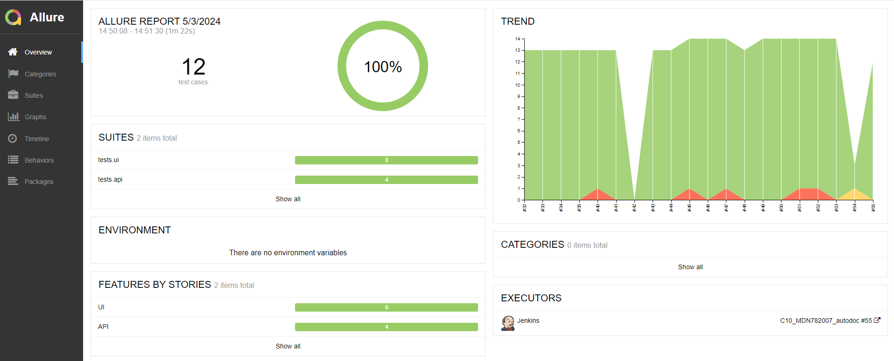
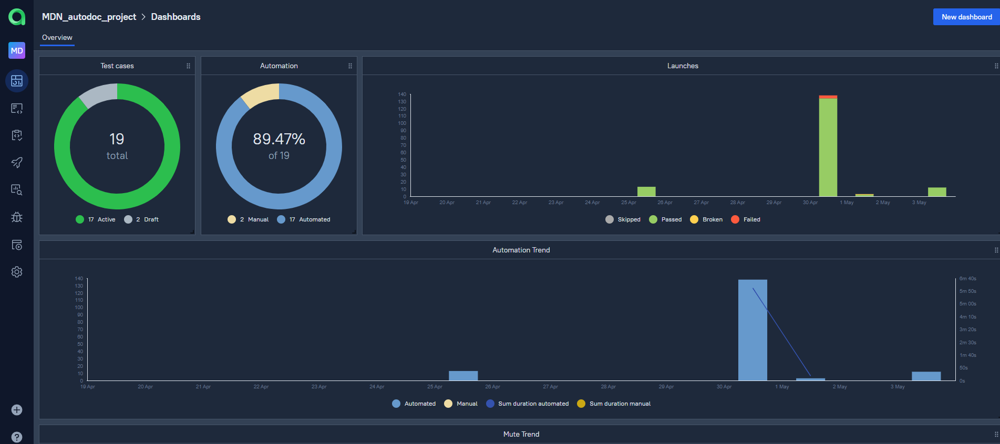

# Проект по тестированию сервиса поиска и подбора автозпчастей, интернет магазин "Автодок"

----
> AUTODOC.RU – ведущий продавец автозапчастей в России с 1998 года. Является одним из лидеров по продажам автомобильных
> товаров от ведущих мировых производителей.  
> [Сайт AUTODOC.RU](https://www.autodoc.ru/)


----

## Список проверок, реализованных в автотестах:

### UI автотесты:

- [x] Проверка формы авторизации на сайте
- [x] Авторизация пользователя на сайте 
- [x] Проверка авторизации зарегестрированного пользователя  
- [x] Проверка формы регистрации сайта  
- [x] Авторизация незарегестрированнного пользователя
- [x] Проверка загрузки главной страницы сайта
- [x] Поиск автозапчасти по названию и номеру детали  
- [x] Поиск каталога по VIN номеру автомобиля

### API автотесты:  

- [x] Проверка авторизации пользователя  
- [x] Валидация JSON схемы страницы пользователя  
- [x] Поиск автозапчасти по названию и номеру детали  
- [x] Поиск по VIN номеру автомобиля  
- [x] Добавление товара в корзину авторизованного пользователя  

### Mobile автотесты:  
- [x] Авторизация зарегистрированного пользователя  
- [x] Поиск продукта по наименованию и номеру детали авторизованным пользователем
- [x] Добавление подукта авторизованным пользователем в корзину по наименованию и номеру детали


----

### Проект реализован с использованием:

<p  align="left">
<code></code>
<code></code>
<code></code>
<code></code>
<code></code>
<code></code>
<code></code>
<code></code>
<code></code>  
<code></code>   
<code></code>  


> Для полноценного прохождения всех тестов должен быть или тестовый аккаунт на сайте ***Автодок*** или реальный, данные
> которого нужно будет указывать в файлах
`.env`
>
Для написания UI-тестов используется фреймворк `Selene`, современная «обёртка» вокруг `Selenium WebDriver`
Библиотека модульного тестирования: `PyTest`  
`Jenkins` выполняет удаленный запуск тестов в графическом интерфейсе. Установки дополнительных приложений на компьютер
пользователя не требуется.  
`Selenoid` запускает браузер с тестами в контейнерах `Docker` (и записывает видео)  
Фреймворк `Allure Report` собирает графический отчет о прохождении тестов  
После завершения тестов `Telegram Bot` отправляет в `Telegram` краткий вариант `Allure Report`

----

###  Локальный запуск UI и API тестов  

Необходимо создать следующий файл:
- `.env`  для запуска UI тестов локально
и заполнить его актуальными тестовыми параметрами.  
Пример заполнения файла указан в файлах с расширением `.____.example`

1) Скачать проект и открыть в IDE
2) Для локального запуска необходимо выполнить команду в терминале с указанием параметров - название и версия браузера:

```commandline
pytest tests\api 
pytest tests\ui --browser_name=<BROWSER_NAME> --browser_version=<BROWSER_VERSION>  
pytest tests\ui_api --browser_name=<BROWSER_NAME> --browser_version=<BROWSER_VERSION>
```
      
3) Выполнить запрос на формирование отчета  
   note: команда для Windows

```commandline
allure serve
```

Результат: откроется страница с отчетом Allure Report

###  Локальный запуск мобильных тестов  
Предусловие:
1) Необходим активный аккаунт на Browserstack
2) Для запуска тестов необходимо залить APK файл с приложением:  
[Ссылка на инструкцию по заливке файла](https://github.com/qa-guru/mobile-tests-13-py/tree/demo-selene-appium-with-browserstack-android#how-to-upload-your-own-version-of-application-to-browserstack)
3) Получить уникальный номер, который будет использоватся в проекте в файлах `.env`  
4) Необходимо создать следующие файлы:
- `.env.bstack`  для запуска мобильных тестов на платформе Browserstack  
- `.env.local_emulator`  для запуска мобильных тестов локально  

  и заполнить их актуальными тестовыми параметрами.  
Пример заполнения файла указан в файлах с расширением `.____.example` 

Для запуска тестов на платформе Browserstack необходимо выполнить следующую команду:  
```commandline
pytest tests/mobile --context=bstack
```

Для запуска на локальной машине должен быть установлен и настроен эмулятор в `Android studio`  

Для запуска тестов на локальной машине необходимо ввести в командной строке:  
```commandline
pytest tests/mobile --context=local_emulator
```
5) Выполнить запрос на формирование отчета  
   note: команда для Windows

```commandline
allure serve
```  

Результат: откроется страница с отчетом Allure Report  

В отчете так же будет доступно видео прохождения мобильного теста:  

  
----

###  Удаленный запуск автотестов выполняется на сервере Jenkins

> <a target="_blank" href="https://jenkins.autotests.cloud/job/C10_MDN782007_autodoc/">Ссылка на проект в
> Jenkins</a>

----

### Параметры сборки:

`BROWSER NAME` - выбор браузера. По умолчанию выбран браузер Chrome.   
`BROWSER VERSION` - выбор версии браузера. По умолчанию выбран браузер Chrome, версия 122  
`COMMENT` - комментарий для получателя уведомления в Телеграмм  
`ENVIRONMENT` - определение среды сборки, по умолчанию `PROD`  

Версии браузеров, используемые в данной сборке в `Jenkins` и `Selenoid`:

| Chrome | Firefox |
|--------|---------|
| 122.0  | 123.0   |
| 121.0  | 122.0   |
| 120.0  | ------- |


#### Для запуска автотестов в Jenkins

1. Открыть <a target="_blank" href="https://jenkins.autotests.cloud/job/C10_MDN782007_autodoc/">проект</a>
2. Выбрать пункт `Build with Parameters`
3. Выбрать браузер
4. Выбрать версию браузера
4. Указать комментарий для уведомления в Телеграмм
5. Нажать кнопку `Build`
6. Результат запуска сборки можно посмотреть в отчёте Allure  


----

###  Allure отчет


Отчет позволяет получить детальную информацию по все шагам тестов, включая скриншоты и log - файлы


###  Allure TestOps отчет  
Полная статистика по прохождению тестпланов, отчёты и приложения к ним хранятся в Allure TestOps  

[Ссылка на проект в AllureTestOps](https://allure.autotests.cloud/project/4198/dashboards)  (запрос доступа `admin@qa.guru`)  

### Суммарный dashboard  
    
### Детально по test cases
  

###  Интеграция с Jira
[Ссылка на проектв Jira](https://jira.autotests.cloud/browse/HOMEWORK-1203)  


###  Видео прохождения теста:

Видеозапись каждого теста генерируется с помощью `Selenoid` после успешного запуска контейнера c тестами в `Docker`.


###  Получение уведомлений о прохождении тестов в Telegram

После завершения сборки специальный Telegram-бот отправляет сообщение с отчетом.  

  


